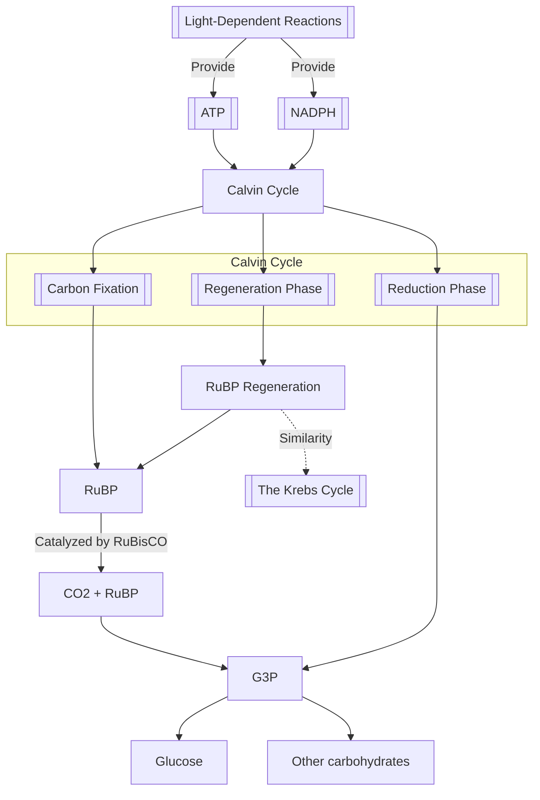

## Photosynthesis  

>[!info] Diagram

[[Photosynthesis]] is the process by which autotrophic organisms, such as plants, algae, and some bacteria, convert light [[energy]] into chemical energy stored in [[Glucose]]. The overall reaction is represented as:  

$6 \, \text{CO}_2 + 6 \, \text{H}_2\text{O} + \text{light energy} \rightarrow \text{C}_6\text{H}_{12}\text{O}_6 + 6 \, \text{O}_2$

This process occurs in two main stages: the [[Light-Dependent Reactions]] and the [[Calvin Cycle]]. Photosynthesis not only provides energy for the organism performing it but also produces oxygen, which is essential for most life on Earth. 