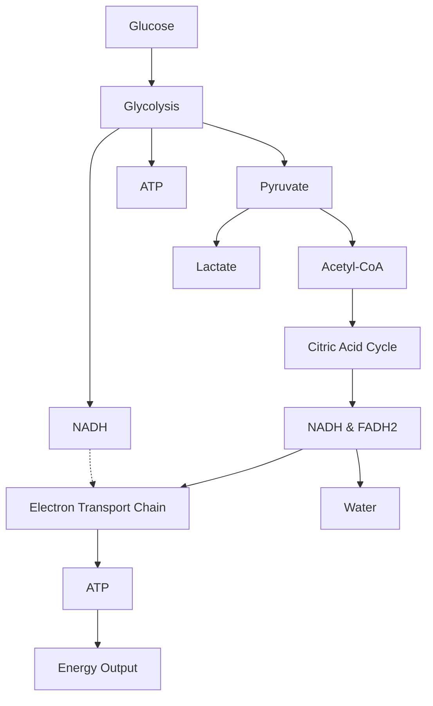

# Unit 3: Cellular Energetics Notes 

-------------

[[Cellular Respiration]]

[[Introduction to Aerobic Respiration]]
[[Glycolysis]]
[[Formation of Acetyl-CoA]]
[[The Krebs Cycle]]
[[Electron Transport Chain]]
[[Chemiosmosis]]
[[Anaerobic Respiration]]
[[Your Muscle Cells Can Ferment]]