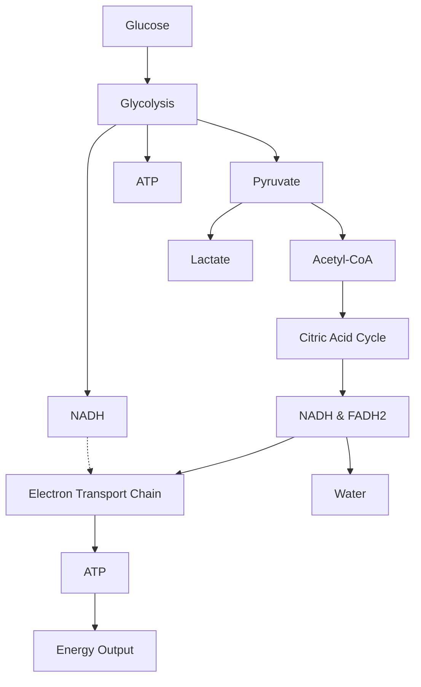
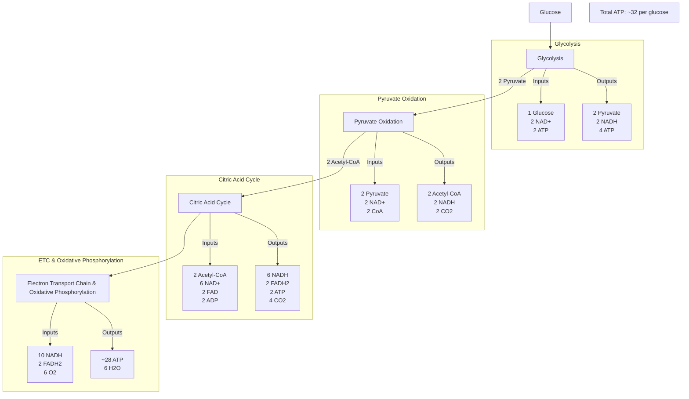

# Unit 3: Cellular Energetics Notes 
Bioenergetics
-------------

Cellular Respiration
--------------------

*   C6H12O6 + 6O2 → 6CO2 + 6H2O + ATP
    
*   You can break cellular respiration down into two different approaches:
    
*   aerobic respiration and anaerobic respiration.
    
*   If ATP is made in the presence of oxygen, we call it aerobic respiration. If oxygen
    
*   If it isn’t present, we call it anaerobic respiration.
    

### Introduction to Aerobic Respiration

Aerobic respiration consists of four stages containing a series of coupled reactions that establish an electrochemical gradient across membranes:

1.  glycolysis
    
2.  formation of acetyl-CoA
    
3.  the Krebs (citric acid) cycle
    
4.  oxidative phosphorylation (the electron transport chain + chemiosmosis)
    

### Stage 1: Glycolysis

*   The first stage begins with glycolysis, the splitting of glucose
    
    *   Glucose is a six-carbon molecule that is broken into two three- carbon molecules called pyruvic acid.
        
    *   This breakdown of glucose also results in the net production of two molecules of ATP and two molecules of NADH.
        
    *   Glucose + 2 ATP + 2NAD+ → 2 Pyruvic acid + 4 ATP + 2NADH
        
    *   Glycolysis also creates two NADH, which result from the transfer of electrons to the carrier NAD+, which then becomes NADH.
        
    *   NAD+ and NADH are constantly being turned into each other as electrons are being carried and then unloaded.
        

There are four important tidbits to remember regarding glycolysis:

*   occurs in the cytoplasm
    
*   net of 2 ATPs produced
    
*   2 pyruvic acids formed
    
*   2 NADH produced
    

### Stage 2: Formation of Acetyl-CoA

*   Pyruvic acid is **transported to the mitochondrion.**
    
*   Each pyruvic acid (a three-carbon molecule) is converted to acetyl-coenzyme
    
*   A (a two-carbon molecule, usually just called acetyl-CoA) and CO2 is released.
    
*   2 Pyruvic acid + 2 Coenzyme A + 2NAD+ → 2 Acetyl-CoA + 2CO2 + 2NADH
    
*   From two 3- carbon molecules to now two 2-carbon molecules.
    
*   The extra carbons leave the cell in the form of CO2. Once again, two molecules of NADH are also produced for each glucose you started with.
    
*   This process of turning pyruvic acid into acetyl-CoA is catalyzed by an enzyme complex called the pyruvate dehydrogenase complex (PDC).
    

### Stage 3: The Krebs Cycle

*   Also known as the **citric acid cycle.**
    
    *   The Krebs cycle begins with each molecule of acetyl-CoA produced from the second stage of aerobic respiration combining with oxaloacetate, a four-carbon molecule, to form a six-carbon molecule, citric acid or citrate.
        
    *   In the mitochondria, pyruvate is turned into acetyl- CoA and 1 NADH is made; double this if you are counting per glucose.
        
    *   The Krebs cycle occurs in the mitochondrial matrix.
        
    *   It begins with acetyl-CoA joining with oxaloacetate to make citric acid and ends with oxaloacetate, 1 ATP, 3 NADH, and 1 FADH2; double this if you are counting per glucose.
        
    *   Citrate gets turned into several other things, and because the cycle begins with a four-carbon molecule, oxaloacetate, it eventually gets turned back into oxaloacetate to maintain the cycle by joining with the next acetyl-CoA coming down the pipeline.
        
*   With each turn of the cycle, three types of [[energy]] are produced:
    
    *   1 ATP
        
    *   3 NADH
        
    *   1 FADH2
        
*   To figure out the total number of products per molecule of glucose, we simply double the number of products.
    

### Stage 4: Oxidative Phosphorylation

### Electron Transport Chain

*   As electrons are removed from a molecule of glucose, they carry much [[energy]] that was originally stored in their chemical bonds.
    
*   These electrons are transferred to readied hydrogen carrier molecules.
    
*   In the case of cellular respiration, these charged carriers are the coenzymes NADH and FADH2.
    
*   We now have:
    
    *   2 NADH molecules from glycolysis
        
    *   2 NADH from the production of acetyl-CoA
        
    *   6 NADH from the Krebs cycle
        
    *   2 FADH2 from the Krebs cycle
        
*   That gives us a total of 12 electron or [[energy]] carriers altogether.
    
*   These electron carriers—**NADH and FADH2—“shuttle”** electrons to the electron transport chain, the resulting NAD+ and FADH can be recycled to be used as carriers again, and the hydrogen atoms are split into hydrogen ions and electrons.
    
*   The high-[[energy]] electrons from NADH and FADH2 are passed down a series of protein carrier molecules that are embedded in the cristae; thus, it is called the electron transport chain.
    
*   Some of the carrier molecules in the electron transport chain are NADH dehydrogenase and cytochrome C.
    
*   Each carrier molecule hands down the electrons to the next molecule in the chain.
    
*   The electrons travel down the electron transport chain until they reach the final electron acceptor, oxygen. Oxygen combines with these electrons (and some hydrogens) to form water.
    
*   This explains the “aerobic” in aerobic respiration. If oxygen weren’t available to accept the electrons, they wouldn’t move down the chain at all, thereby shutting down the whole process of electron transport.
    

### Chemiosmosis

*   The [[energy]] released from the electron transport chain is used to pump hydrogen ions across the inner mitochondrial membrane from the matrix into the inter-membrane space.
    
*   The pumping of hydrogen ions into the inter-membrane space creates a pH gradient, or **proton gradient.**
    
*   The hydrogen ions really want to diffuse back into the matrix. The potential [[energy]] established in this gradient is responsible for the production of ATP.
    
*   This pumping of ions and diffusion of ions to create ATP is chemiosmosis
    
*   Overall, this process is called oxidative phosphorylation because when electrons are given up it is called “oxidation” and then ADP is “phosphorylated” to make ATP.
    
*   You’re also expected to know the following two things for the AP Biology Exam:
    
*   Every NADH from glycolysis yields 1.5 ATP and all other NADH molecules yield 2.5 ATP.
    
*   Every FADH2 yields 1.5 ATP.
    

You will also want to make sure you remember the major steps of cell respiration, and the outcome of each steM

### Photosynthesis vs. Cell Respiration

*   In both cases, ATP production is driven by a proton gradient, and the proton gradient is **created by an electron transport chain.**
    
*   In respiration, protons are pumped from the mitochondrial matrix to the intermembrane space, and they return to the matrix through an ATP synthase down their concentration gradient.
    
*   In photosynthesis, protons are pumped from the stroma into the thylakoids compartment, and they return to the stroma through an ATP synthase down their concentration gradient.
    
*   The **Krebs cycle seeks to oxidize carbohydrates to CO2, while the Calvin cycle seeks to reduce CO2 to carbohydrates.**
    

### Anaerobic Respiration

*   When **oxygen is not available,** the anaerobic version of respiration occurs.
    
    *   The electron transport chain stops working, and electron carriers have nowhere to drop their electrons.
        
    *   The mitochondrial production of acetyl- CoA and the Krebs cycle cease too.
        
    *   Glycolysis, however, can continue to run. This means that glucose can be broken down to give net two ATP. Only two instead of 30!
        
    *   Glycolysis also gives two pyruvates and two NADH. The pyruvate and NADH make a deal with each other, and pyruvate helps NADH get recycled back into NAD+ and takes its electrons.
        
    *   The pyruvate turns into either lactic acid (in muscles) or ethanol (in yeast).
        
    *   Since these two things are toxic at high concentrations, this process, called fermentation, is done only in emergencies. Aerobic respiration is a better option
        
*   What types of organisms undergo fermentation?
    
    *   Yeast cells and some bacteria make ethanol and carbon dioxide. Other bacteria produce lactic acid.
        

### Your Muscle Cells Can Ferment

*   A **cramp** was possibly the consequence of anaerobic respiration.
    
*   When you exercise, your muscles require a lot of [[energy]].
    
*   To get this [[energy]], they convert enormous amounts of glucose to ATP.
    
*   As you continue to exercise, your body doesn’t get enough oxygen to keep up with the demand in your muscles. This creates an oxygen debt.
    
*   Muscles switch over to anaerobic respiration.
    
*   **Pyruvic acid produced** from glycolysis is converted to lactic acid.