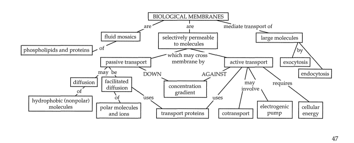

# Overview: Life at the Edge

- **Plasma Membrane**: Boundary separating the living cell from its environment.
  - Exhibits **selective permeability**: Allows certain substances to cross more easily.

---

# Concept 7.1: Fluid Mosaic Model of Membranes

- **Phospholipids**:
  - Most abundant lipid.
  - Amphipathic (hydrophobic tails, hydrophilic heads).
- **Fluid Mosaic Model**:
  - Membrane = Fluid structure with embedded "mosaic" proteins.

## Membrane Models and History

- 1935: **Davson-Danielli model**:
  - Phospholipid bilayer sandwiched by globular proteins.
- 1972: **Singer and Nicolson**:
  - Membrane = Mosaic of proteins within the bilayer.
  - Hydrophilic regions exposed; hydrophobic regions embedded.

## Membrane Fluidity

- **Lipid Movement**:
  - Lateral movement frequent; flip-flopping rare.
- **Temperature Effects**:
  - Cold: Membrane solidifies.
  - Unsaturated fatty acids = Greater fluidity.
- **Cholesterol Role**:
  - At 37°C: Restrains lipid movement.
  - At low temps: Prevents tight packing, maintaining fluidity.

---

# Concept 7.2: Selective Permeability

## Lipid Bilayer Permeability

- **Hydrophobic molecules** (e.g., hydrocarbons): Pass through easily.
- **Polar molecules** (e.g., sugars): Cross slowly or need assistance.

## Transport Proteins

- **Channel Proteins**:
  - Provide hydrophilic tunnels.
  - Example: **Aquaporins** (water transport).
- **Carrier Proteins**:
  - Bind and shuttle molecules via shape changes.
  - Specific to transported substance.

---

# Concept 7.3: Passive Transport

## Diffusion
- Movement down the concentration gradient without [[energy.md |energy]] use.
- At equilibrium: Equal movement in both directions.

## Osmosis
- Diffusion of water across a membrane.
- Direction: Low to high solute concentration.

## Tonicity and Water Balance

- **Isotonic**: Equal amount of solute on both sides. No net water movement.
- **Hypertonic**: More solute outside cell Cell loses water.
- **Hypotonic**: More solute inside cell. Cell gains water.

---

# Passive Transport (Detailed Notes)

### Diffusion
- Goes straight through the membrane.
- **Must be small and nonpolar**, e.g., O₂ and CO₂.

### Osmosis
- Diffusion of water.
- Can also use aquaporin.

### Facilitated Diffusion
- Uses a transport protein.
- Large and/or polar molecules.
- Can be a channel or carrier.
- **Substances only move with their own concentration gradient.**
- Does not take [[energy.md |energy]] to move with the gradient.
- **Happens until equilibrium is reached, net movement = 0.**

### Tonicity
- **Ability of a cell to lose or gain water.**
- **Plant cells** like to be turgid in hypotonic solutions.
- **Animal cells** like to be in an isotonic solution (0.9% NaCl).

---

# Concept 7.4: Active Transport

- Moves solutes **against** their gradients using **ATP**.
- **Sodium-Potassium Pump**:
  - Exchanges 3 Na⁺ out for 2 K⁺ in.
  - Maintains cell's membrane potential (voltage difference).

## Active Transport (Detailed Notes)

- **Requires [[energy.md |energy]] (ATP).**
- Can go against the concentration gradient.

### Potassium-Sodium Pump
1. 3 Na⁺ bind to the inside of the protein.
2. ATP attaches and breaks, reshaping the protein.
3. 3 Na⁺ leave, and 2 K⁺ come in, resetting the pump.

### Electrogenic Pumps
- Generate voltage.
- Examples:
  - Sodium-potassium pump (animals).
  - Proton pump (plants, fungi, bacteria).

---

# Concept 7.5: Bulk Transport

- **Exocytosis**:
  - Vesicles fuse with the membrane to release contents.
- **Endocytosis**:
  - Membrane forms vesicles to bring materials inside.
  - Types:
    - **Phagocytosis**: Engulfs large solid particles.
    - **Pinocytosis**: Engulfs extracellular fluid.
    - **Receptor-mediated**: Specific ligands trigger vesicle formation.

---

# Membrane Proteins and Functions

- Types:
  - **Peripheral Proteins**: Bound to membrane surface.
  - **Integral Proteins**: Penetrate hydrophobic core; may span membrane (transmembrane proteins).
- **Functions**:
  - Transport.
  - Enzymatic activity.
  - Signal transduction.
  - Cell-cell recognition.
  - Intercellular joining.
  - Attachment to cytoskeleton and ECM.

---

# Summary Concepts

1. **Amphipathic molecules**: Hydrophobic and hydrophilic regions (e.g., phospholipids).
2. **Membrane fluidity** influenced by:
   - Temperature.
   - Fatty acid saturation.
   - Cholesterol presence.
3. **Transport mechanisms**:
   - Passive: Diffusion, osmosis, facilitated diffusion.
   - Active: Requires ATP.
4. **Electrogenic pumps** create voltage:
   - Sodium-potassium pump.
   - Proton pump.
5. **Bulk transport**: Exocytosis and endocytosis manage large molecules.

---

# Osmoregulation

- **Control of water balance.**
  - Kidneys do this in humans.
  - Contractile vacuoles do this in protists (e.g., paramecium).

---

# Facilitation Proteins

- Assist molecules across the membrane.
- Cannot go against the concentration gradient.

## Gated Ion Channels
- Allow in ions but are locked.
- Ligands act as the "keys" to open them.

## Symporter
- 2 ions move in the **same direction**.

## Antiporter
- 2 ions move in **opposite directions**.
